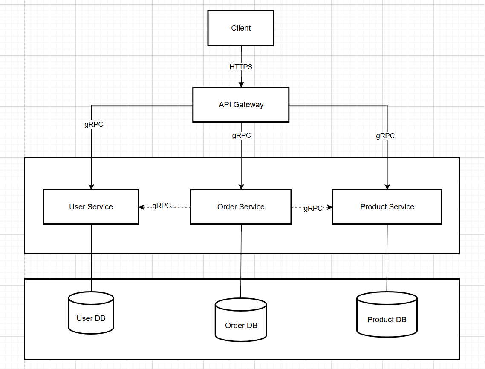

# gRPC Microservices Learning Environment

This repository provides a hands-on learning environment for DevOps concepts using a Go-based gRPC microservices architecture.

## Architecture Diagram



## ✨ Key Features

- **Services**: User, Product, and Order services demonstrating inter-service communication.
- **API Gateway**: Exposes a RESTful API to the outside world using gRPC-Gateway.
- **Technology Stack**: Go, gRPC, Protocol Buffers, Docker.
- **Best Practices**: Clean Architecture, structured logging, configuration management, and graceful shutdown.

## 🚀 Getting Started

### Prerequisites

- Go (1.23+)
- Docker & Docker Compose
- Make
- `protoc` compiler

### Quick Start

1.  **Clone the repository:**
    ```bash
    git clone <repository>
    cd learning
    ```

2.  **Install dependencies and generate Protobuf code:**
    ```bash
    make deps
    make proto
    ```

3.  **Run the entire system with Docker Compose (Recommended):**
    ```bash
    make docker-up
    ```

4.  **Verify the services are running:**
    - API Gateway Health Check: `http://localhost:8080/health`
    - View logs: `make logs` or `make logs service=user-service`

## 🛠️ Development & Makefile Commands

This project uses a `Makefile` to streamline development tasks.

| Command | Description |
| :--- | :--- |
| `make proto` | Generates Go code from `.proto` files. |
| `make build` | Builds all service binaries. |
| `make run-user` | Runs the User service locally. |
| `make run-product` | Runs the Product service locally. |
| `make run-order` | Runs the Order service locally. |
| `make run-gateway` | Runs the API Gateway locally. |
| `make test` | Runs all tests. |
| `make docker-build` | Builds Docker images for all services. |
| `make docker-up` | Starts all services using Docker Compose. |
| `make docker-down` | Stops all running services. |
| `make logs` | Tails the logs for all services. |

## ⚙️ Configuration

Service configurations are managed via environment variables. Refer to `docker-compose.yml` and the `internal/common/config.go` file for details.

| Variable | Default | Description |
|---|---|---|
| `HOST` | `localhost` | Server host |
| `USER_SERVICE_PORT` | `50051` | User service gRPC port |
| `PRODUCT_SERVICE_PORT` | `50052` | Product service gRPC port |
| `ORDER_SERVICE_PORT` | `50053` | Order service gRPC port |
| `GATEWAY_PORT` | `8080` | API Gateway REST port |
| `LOG_LEVEL` | `info` | Logging level (`debug`, `info`, `warn`, `error`) |

##  DevOps Learning Roadmap

This repository serves as a base for exploring various DevOps tools and practices:

- **CI/CD**: Implement a pipeline using GitHub Actions or Jenkins.
- **Container Orchestration**: Deploy services to Kubernetes.
- **Monitoring**: Integrate Prometheus for metrics and Grafana for dashboards.
- **Logging**: Set up a centralized logging solution like the ELK/EFK stack.
- **Infrastructure as Code**: Use Terraform to provision cloud resources.
- **Security**: Implement security scanning and best practices.

## 🤝 Contributing

Contributions are welcome! Please fork the repository and open a pull request.

## 📝 License

This project is licensed under the MIT License. 